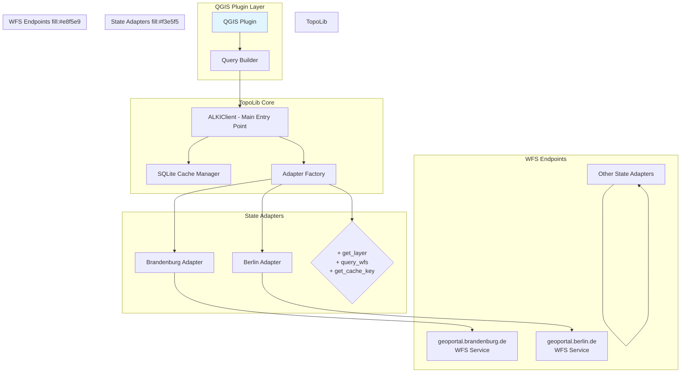
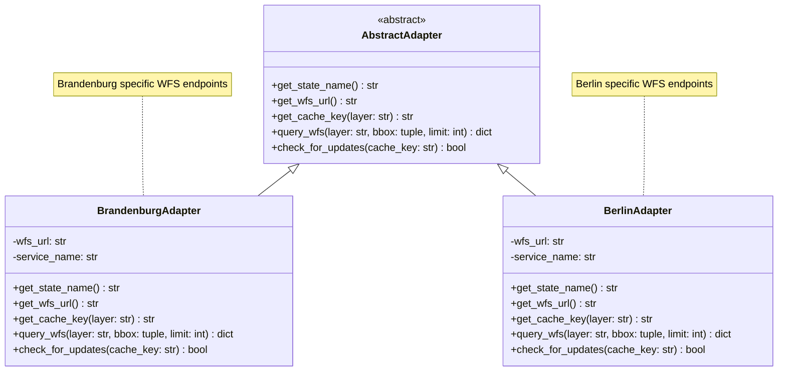
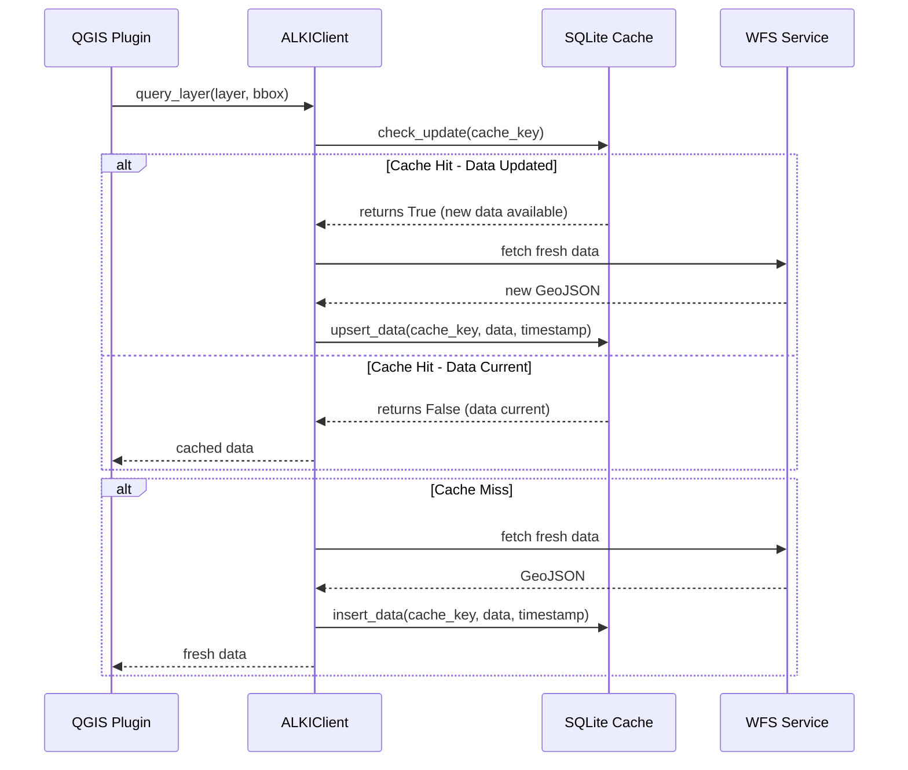
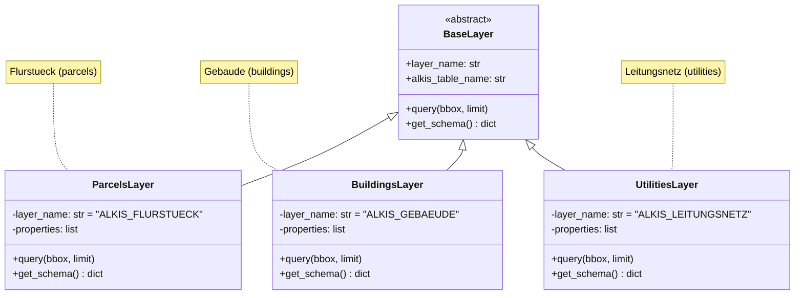
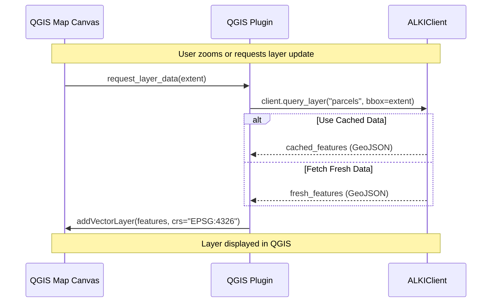

# TopoLib - ALKIS Unified Access Library

## Overview

A Python library that provides unified access to WFS ALKIS (Amtliches Kadaster- und Leitungsinformationssystem) data from German states, with SQLite caching and incremental update support.

## Architecture Diagram



## Project Structure

```
topolib/
├── __init__.py              # Package initialization, version
├── client.py                # Main ALKIClient entry point
├── cache/
│   ├── __init__.py
│   └── manager.py           # SQLite cache with incremental updates
├── adapters/
│   ├── __init__.py
│   ├── base.py              # AbstractAdapter base class
│   ├── brandenburg.py       # Brandenburg implementation
│   ├── berlin.py            # Berlin implementation
│   └── factory.py           # Adapter factory pattern
├── layers/
│   ├── __init__.py
│   ├── base.py              # Layer abstraction
│   ├── parcels.py           # Flurstueck layer
│   ├── buildings.py         # Gebaeude layer
│   ├── utilities.py         # Leitungsnetz layer
│   └── addresses.py         # Adressen layer
├── models/
│   ├── __init__.py
│   ├── alkis_types.py       # ALKIS-specific data types
│   └── geometry.py          # Geometry handling (WKT/GeoJSON)
├── config/
│   ├── __init__.py
│   └── settings.py          # Configuration management
├── utils/
│   ├── __init__.py
│   ├── pagination.py        # WFS pagination handling
│   └── validation.py        # Response validation
└── tests/
    ├── __init__.py
    └── test_adapters.py     # Adapter tests
```

## Core Components

### 1. ALKIClient (Main Entry Point)

```python
class ALKIClient:
    """
    Main client for accessing ALKIS data with caching support.
    
    Usage:
        from topolib import ALKIClient
        
        client = ALKIClient(
            cache_path="alkis_cache.db",
            default_state="brandenburg"
        )
        
        # Query parcels in current map extent
        parcels = client.query_layer(
            layer="parcels",
            bbox=get_current_map_bbox(),
            format="geojson"
        )
    """
```

### 2. Adapter Interface Pattern



### 3. SQLite Cache Manager with Incremental Updates



### 4. Layer Abstraction



## WFS ALKIS Layer Mapping

Based on standard ALKIS WFS services across German states:

| Logical Layer | ALKIS Table | WFS Service Name | Description |
|--------------|-------------|------------------|-------------|
| parcels | FLURSTUECK | ALKIS_FLURSTUECK | Cadastral parcels |
| buildings | GEBAEUDE | ALKIS_GEBAEUDE | Building footprints |
| utilities | LEITUNGSNETZ | ALKIS_LEITUNGSNETZ | Utility networks |
| addresses | ADRESSEN | ALKIS_ADRESSEN | Address data |
| property_owners | GRUNDSTUECKSINHABER | ALKIS_GRUNDSTUECKSINHABER | Ownership info |
| parcels_admin | FLURSTUECK_ADMIN | ALKIS_FLURSTUECK_ADMIN | Admin parcel data |

## Cache Schema Design

```sql
-- Main cache table for storing WFS responses
CREATE TABLE alkis_cache (
    cache_key TEXT PRIMARY KEY,
    layer_name TEXT NOT NULL,
    state_name TEXT NOT NULL,
    wfs_url TEXT NOT NULL,
    data JSON NOT NULL,
    cached_at TIMESTAMP NOT NULL,
    updated_at TIMESTAMP NOT NULL,
    bbox TEXT NOT NULL,  -- WKT bounding box for this query
    feature_count INTEGER NOT NULL,
    checksum TEXT NOT NULL  -- SHA256 of response for change detection
);

-- Index for efficient queries by layer and state
CREATE INDEX idx_cache_layer_state ON alkis_cache(layer_name, state_name);

-- Index for time-based queries (find latest data per layer)
CREATE INDEX idx_cache_updated ON alkis_cache(updated_at);

-- Metadata table for tracking WFS service capabilities
CREATE TABLE alkis_metadata (
    wfs_url TEXT PRIMARY KEY,
    service_name TEXT NOT NULL,
    available_layers JSON NOT NULL,
    last_verified TIMESTAMP,
    version TEXT
);
```

## Configuration Schema

```python
# config/settings.py structure

class ALKISConfig:
    """Configuration for ALKIS client."""
    
    class CacheSettings:
        cache_path: str = "alkis_cache.db"
        max_cache_size_mb: int = 1024
        check_for_updates_interval_seconds: int = 300  # 5 minutes
    
    class StateConfig:
        brandenburg: dict = {
            "name": "Brandenburg",
            "wfs_url": "https://geoportal.brandenburg.de/gs/wfs",
            "service_name": "ALKIS",
            "default_layers": ["parcels", "buildings", "utilities"]
        }
        
        berlin: dict = {
            "name": "Berlin",
            "wfs_url": "https://geoportal.berlin.de/gs/wfs",  # Example URL
            "service_name": "ALKIS",
            "default_layers": ["parcels", "buildings", "utilities"]
        }
        
        # Other states can be added here
```

## QGIS Plugin Integration Pattern



## Implementation Steps

### Phase 1: Core Infrastructure
1. Create package structure and base classes
2. Implement AbstractAdapter interface
3. Implement SQLite cache manager with upsert logic
4. Create configuration management

### Phase 2: Brandenburg Adapter (POC)
1. Analyze Brandenburg WFS endpoints
2. Implement BrandenburgAdapter
3. Define layer abstractions for all ALKIS layers
4. Test basic query functionality

### Phase 3: Berlin Adapter
1. Research Berlin WFS endpoints
2. Implement BerlinAdapter following same pattern
3. Add to adapter factory

### Phase 4: Additional States
1. Create template adapters for other states
2. Document state-specific configuration requirements
3. Enable easy addition of new state adapters

### Phase 5: QGIS Integration
1. Create GeoJSON to QGIS layer converter
2. Implement extent-based querying
3. Add refresh/force-update functionality

## Key Design Decisions

### 1. Adapter Pattern for State Flexibility
- Each German state may have different WFS endpoints and service names
- AbstractAdapter interface ensures consistent API across states
- Factory pattern makes it easy to add new states

### 2. SQLite Cache with Checksum Validation
- Store full GeoJSON responses in cache
- Use SHA256 checksum of response for change detection
- Compare checksums to determine if refresh needed
- Bounding box included in cache key for spatial queries

### 3. No Authentication Required
- Design assumes public WFS endpoints (no credentials)
- If authentication is needed later, add optional auth parameters
- Keep API simple for initial POC

### 4. GeoJSON Format
- All responses in GeoJSON format (QGIS native)
- Client handles pagination automatically
- Geometry preserved as WKT or GeoJSON geometries

## Example Usage

```python
from topolib import ALKIClient

# Initialize client with SQLite cache
client = ALKIClient(
    cache_path="alkis_cache.db",
    default_state="brandenburg"
)

# Query parcels for current map extent
def load_parcels_for_map_extent(extent_bbox):
    """Load parcel data for given bounding box."""
    return client.query_layer(
        layer="parcels",
        bbox=extent_bbox,  # (minx, miny, maxx, maxy)
        limit=None  # No limit for full extent query
    )

# Query with limit for performance
def load_parcels_sample(extent_bbox, limit=1000):
    """Load parcel data with limit."""
    return client.query_layer(
        layer="parcels",
        bbox=extent_bbox,
        limit=limit
    )

# Force refresh from WFS (ignore cache)
def force_refresh(layer_name, bbox):
    """Force fresh data fetch from WFS."""
    return client.force_fetch(layer_name, bbox)
```

## API Reference

### ALKIClient Methods

| Method | Parameters | Returns | Description |
|--------|------------|---------|-------------|
| `query_layer()` | layer, bbox, limit, state | dict | Query with cache check |
| `force_fetch()` | layer, bbox, state | dict | Bypass cache, fetch fresh |
| `get_cached_data()` | layer, bbox, state | dict or None | Get cached data only |
| `clear_cache()` | layer=None | None | Clear all or specific cache |

### Adapter Interface Methods

| Method | Parameters | Returns | Description |
|--------|------------|---------|-------------|
| `get_state_name()` | - | str | State name (e.g., "Brandenburg") |
| `get_wfs_url()` | - | str | WFS service URL |
| `get_cache_key()` | layer | str | Generate cache key |
| `query_wfs()` | layer, bbox, limit | dict | Raw WFS query result |
| `check_for_updates()` | cache_key | bool | Check if data changed |

## Next Steps

1. Review architecture plan
2. Approve design decisions
3. Switch to Code mode for implementation
4. Start with Phase 1: Core Infrastructure
